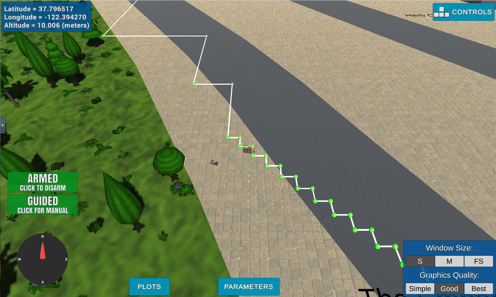

## Project: 3D Motion Planning


---

# Required Steps for a Passing Submission:
1. Load the 2.5D map in the colliders.csv file describing the environment.
2. Discretize the environment into a grid or graph representation.
3. Define the start and goal locations.
4. Perform a search using A* or other search algorithm.
5. Use a collinearity test or ray tracing method (like Bresenham) to remove unnecessary waypoints.
6. Return waypoints in local ECEF coordinates (format for `self.all_waypoints` is [N, E, altitude, heading], where the drone’s start location corresponds to [0, 0, 0, 0].
7. Write it up.
8. Congratulations!  Your Done!

## [Rubric](https://review.udacity.com/#!/rubrics/1534/view) Points
### Here I will consider the rubric points individually and describe how I addressed each point in my implementation.  

---

### Writeup / README

#### 1. Provide a Writeup / README that includes all the rubric points and how you addressed each one.  You can submit your writeup as markdown or pdf.  

You're reading it! Below I describe how I addressed each rubric point and where in my code each point is handled.

### Explain the Starter Code

#### 1. Explain the functionality of what's provided in `motion_planning.py` and `planning_utils.py`
These scripts contain a basic planning implementation that includes the planning_utils.py file which has the main python functions create_grid(), valid_actions() and a_star()

However, the main code is the motion_planning.py file

The code includes the function plan_path, which reads the colliders.csv file, sets the global_position, creates the grid, calculating the path, using the functions from planning_utils to push the drone forward and perform those actions.

And here's a lovely image of my results


### Implementing Your Path Planning Algorithm

#### 1. Set your global home position
Here students should read the first line of the csv file, extract lat0 and lon0 as floating point values and use the self.set_home_position() method to set global home. Explain briefly how you accomplished this in your code.

The code below will show how I was able to extract the lat0 and lon0 and then set the position.
It will show opening the file colliders.csv, then reading the file to extract the lat0 and lon0, then setting that position by using the function set_home_position()

```
with open('colliders.csv') as f:
    reader = f.readline().split(',')
lat0 = float(reader[0].strip().split(' ')[1])
lon0 = float(reader[1].strip().split(' ')[1])

self.set_home_position(lon0, lat0, 0)
```

#### 2. Set your current local position
Here as long as you successfully determine your local position relative to global home you'll be all set. Explain briefly how you accomplished this in your code.

The code below shows how I was able to get local position from my global home...

```
# TODO: convert to current local position using global_to_local()
local_position = global_to_local(global_position, self.global_home)
```

#### 3. Set grid start position from local position
This is another step in adding flexibility to the start location. As long as it works you're good to go!

This code below shows how I was able to get my grid start position from the code shown above...
```
grid_start = (int(local_position[0] - north_offset), int(local_position[1] - east_offset))
```

Look at that drone go!



#### 4. Set grid goal position from geodetic coords
This step is to add flexibility to the desired goal location. Should be able to choose any (lat, lon) within the map and have it rendered to a goal location on the grid.

#### 5. Modify A* to include diagonal motion (or replace A* altogether)
Minimal requirement here is to modify the code in planning_utils() to update the A* implementation to include diagonal motions on the grid that have a cost of sqrt(2), but more creative solutions are welcome. Explain the code you used to accomplish this step.

#### 6. Cull waypoints 
For this step you can use a collinearity test or ray tracing method like Bresenham. The idea is simply to prune your path of unnecessary waypoints. Explain the code you used to accomplish this step.

The drone points were checked to see if there is collinerarity, if they are then the points would be then be pruned out and given a route that would be more efficient (for example: if a path has three points and all three points are going the same path, then the middle point would be taken out). The code below shows how prune and collinerity is written. 

```
def collinearity_check(p1, p2, p3, epsilon=1e-6):   
    m = np.concatenate((p1, p2, p3), 0)
    det = np.linalg.det(m)
    return abs(det) < epsilon

def prune_path(path): 
    pruned_path = [p for p in path]

    i = 0
    while i < len(pruned_path) - 2:
        p1 = point(pruned_path[i])
        p2 = point(pruned_path[i+1])
        p3 = point(pruned_path[i+2])

        if collinearity_check(p1, p2, p3):
            pruned_path.remove(pruned_path[i+1])
        else:
            i += 1
    return pruned_path
```

### Execute the flight
#### 1. Does it work?
It works!

### Double check that you've met specifications for each of the [rubric](https://review.udacity.com/#!/rubrics/1534/view) points.
  
# Extra Challenges: Real World Planning

For an extra challenge, consider implementing some of the techniques described in the "Real World Planning" lesson. You could try implementing a vehicle model to take dynamic constraints into account, or implement a replanning method to invoke if you get off course or encounter unexpected obstacles.
